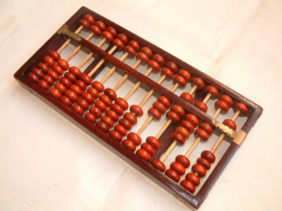
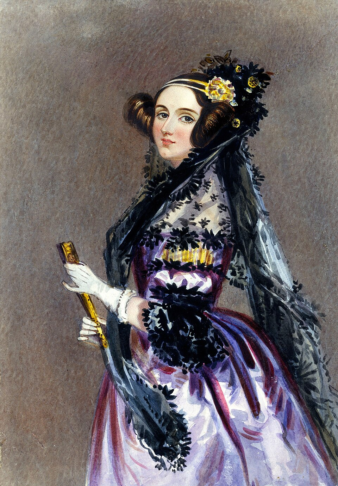
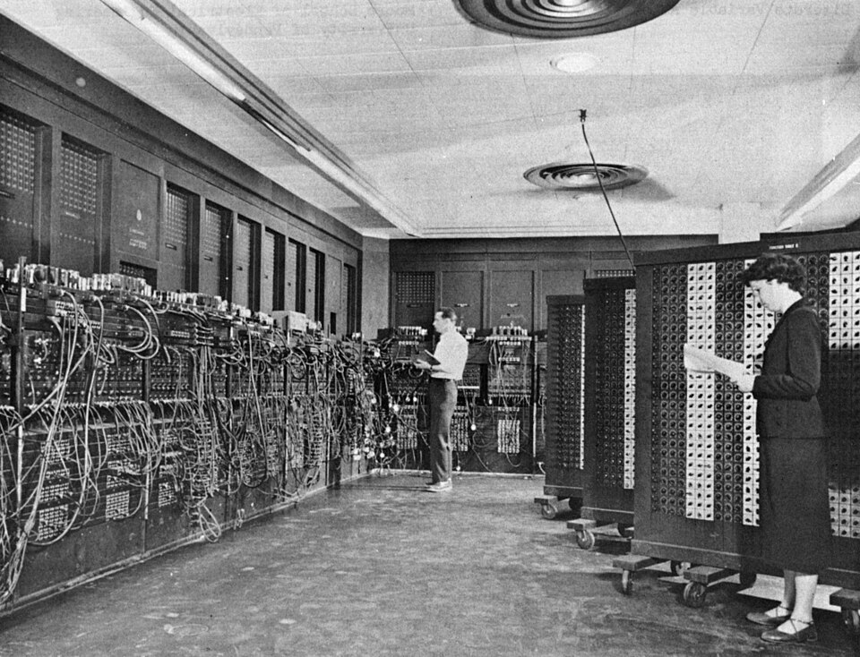

## Objetivos de aprendizaje

Al terminar esta lección podrás:

- **Describir** la evolución de los mecanismos de cómputo y nombrar hitos clave, y reconocer su idea común: *automatizar el conteo y el cálculo*. *(Comprender)*
- **Explicar** que la palabra "computadora" significó por siglos una **persona** (a menudo una mujer) que calculaba a mano, y cómo se pasó de personas a máquinas. *(Comprender)*
- **Explicar**, a nivel de idea, la observación de Turing: para construir una máquina que calcule, primero hay que entender *qué hace una persona cuando calcula*. *(Comprender)*
- **Contrastar** el software de **código abierto** con el **propietario** y clasificar las herramientas de este curso. *(Analizar)*
- **Reconocer** la computación como una herramienta para el trabajo científico en biología y química. *(Comprender)*
- **Discutir** el papel y la importancia de las computadoras y los algoritmos en la sociedad actual. *(Evaluar)*

> **Dónde encaja:** es la primera lección del curso · antes de la L02 (*Arquitectura y representación de datos*).

## Por qué importa

Hace cien años, si un laboratorio pedía "una computadora" para sus cálculos, no llegaba una máquina: llegaba una **persona** —muy a menudo una mujer— que hacía las cuentas a mano, con lápiz y papel. Esas personas calculaban órbitas en astronomía, tablas de artillería en la guerra y trayectorias para la NASA. Eran **cálculo científico** hecho a mano.

Este curso trata de lo que vino después: las máquinas automatizaron ese trabajo, y hoy **tú** puedes programarlas. La meta del curso es que uses la computadora como una herramienta para tu propia ciencia —biología y química—: para buscar datos, analizarlos, visualizarlos y procesar imágenes.

> **Analogía:** una computadora moderna es una versión muy rápida y **programable** del ábaco o de la regla de cálculo: aparatos que la gente inventó, a lo largo de milenios, para no tener que calcular todo a mano.

## Una breve historia: de los aparatos de cómputo a la PC

Computar significa, sencillamente, *contar o calcular*. A lo largo de la historia la humanidad construyó aparatos para automatizar esos conteos y cálculos. Conviene verlos como un **mapa por épocas**, no como una lista de fechas:

```{mermaid}
flowchart LR
    A["<b>Mecánica</b><br/>ábaco, khipu<br/>regla de cálculo<br/>Pascalina, Leibniz"] --> B["<b>Programable</b><br/>telar de Jacquard<br/>Babbage<br/>Ada Lovelace"]
    B --> C["<b>Electrónica</b><br/>Atanasoff<br/>Colossus, ENIAC"]
    C --> D["<b>Personal</b><br/>transistor<br/>circuito integrado<br/>IBM-PC y hoy"]
```

{width=45%}

| Época | Hito | Año aprox. | Qué aportó |
|-------|------|-----------|------------|
| Mecánica | Ábaco | ~2700 a.C. | Sumar, restar y multiplicar con cuentas |
| Mecánica | Khipu (Sudamérica) | 1100-1532 | Registrar números con nudos en cuerdas |
| Mecánica | Regla de cálculo (Oughtred) | ~1620 | Multiplicar, dividir, logaritmos, raíces |
| Mecánica | Pascalina (Pascal) | 1642 | Calculadora mecánica: suma y resta |
| Mecánica | Máquina de Leibniz | ~1670s | Las cuatro operaciones y raíces |
| Programable | Telar de Jacquard | 1801 | **Tarjetas perforadas** para tejer patrones |
| Programable | Motor diferencial y analítico (Babbage) | 1822-1834 | Máquina mecánica de **propósito general** |
| Programable | Ada Lovelace | 1843 | El **primer programa** de la historia |
| Electrónica | Computadora de Atanasoff | 1930s | Primera computadora electrónica digital |
| Electrónica | Colossus / ENIAC | 1940s | Tubos de vacío; cálculo a gran escala |
| Personal | Transistor y circuito integrado | 1950s-60s | Miles de componentes en poco espacio |
| Personal | IBM-PC | 1980s | La computadora llega al escritorio |

Fíjate en el salto entre épocas: de aparatos que *ayudaban* a calcular a máquinas que *siguen instrucciones* por su cuenta.

## De aparato a "programa": Jacquard, Babbage y Ada Lovelace

El **telar de Jacquard** (1801) tejía patrones complejos leyendo **tarjetas perforadas**: los huecos en la tarjeta le decían al telar qué hacer en cada paso. Es una idea poderosa: *las instrucciones se pueden guardar como un patrón físico* y la máquina las sigue.

Charles **Babbage** llevó esa idea al cálculo. Su **motor analítico** (1834) iba a ser una máquina mecánica de **propósito general**: usaría tarjetas perforadas como un programa para hacer operaciones aritméticas y lógicas. **Ada Lovelace** escribió para esa máquina lo que se considera el **primer programa** de la historia.

{width=40%}

::: {.callout-note}
## ¿Qué es un *programa*?
Un **programa** es un conjunto de **instrucciones** que una máquina sigue, paso a paso, para realizar una tarea. La parte física de la computadora (los circuitos, la pantalla, la memoria) es el **hardware**; los programas que ejecuta son el **software**.
:::

## ¿Qué era una "computadora"? De personas a máquinas

Aquí está el giro sorprendente. Durante siglos, una **"computadora" era una persona** que computaba: hacía cálculos largos y repetitivos a mano. Era un trabajo muy **feminizado** y mal pagado. Algunos ejemplos reales:

- Las **computistas de la astronomía** (por ejemplo en el Observatorio de Harvard) que catalogaron miles de estrellas.
- Las **200 mujeres** de la Moore School que, durante la Segunda Guerra Mundial, calculaban tablas de artillería a mano; varias de ellas **programaron luego el ENIAC**, una de las primeras computadoras electrónicas.
- Las computistas de la **NASA** que calcularon trayectorias para los vuelos espaciales (la historia de *Hidden Figures*).

{width=70%}

¿Cómo se pasó de personas a máquinas? Esa es justo la pregunta que se hizo **Alan Turing**.

::: {.callout-important}
## La idea de Turing (1936)
Para imaginar una máquina que calculara, Turing primero analizó **qué hace exactamente una persona cuando calcula**: lee y escribe símbolos en papel, sigue un conjunto de reglas, y recuerda en qué paso va. Mostró que una máquina muy simple podría hacer lo mismo. Esa es, en esencia, la idea de qué significa **computar** —y la semilla de la noción de **algoritmo** (una receta de pasos) que veremos en la L04.
:::

Nos quedamos con **la idea**, no con el formalismo: este es un curso de programación para la ciencia, no de teoría de la computación.

## Código abierto vs. software propietario

No todo el software se distribuye igual. Dos grandes filosofías:

- **Código abierto** (*open source*): cualquiera puede **ver, usar y modificar** el código fuente. Suele ser gratuito y desarrollado por comunidades.
- **Propietario**: el código es **cerrado**; se usa bajo una licencia (a menudo de pago) y no se puede inspeccionar ni modificar.

| | Código abierto | Propietario |
|---|---|---|
| ¿Puedes ver y modificar el código? | Sí | No |
| Costo típico | Gratuito | Licencia / pago |
| Ejemplos | Python, Jupyter, Linux, Firefox | Windows, MATLAB, Photoshop |
| Para la ciencia | Favorece la **reproducibilidad** | Puede limitar el acceso |

::: {.callout-tip}
## Por eso este curso usa Python
Programaremos en **Python** con **Jupyter / Google Colab**: son de **código abierto** y gratuitos. Cualquiera puede reproducir tu análisis sin comprar una licencia —algo muy valioso en la ciencia, donde los resultados deben poder repetirse.
:::

## Las computadoras y los algoritmos hoy

De aquel cuarto lleno de computistas humanos pasamos, en menos de un siglo, a un algoritmo en tu bolsillo. Un **algoritmo** es la *receta de pasos* que sigue la computadora —la misma idea intuitiva que analizó Turing—, y hoy esos algoritmos están en todas partes: en las búsquedas y los mapas, en las recomendaciones que ves, en el diagnóstico médico, en los modelos del clima, en el diseño de fármacos y en la genómica.

Para la ciencia, esto cambió las reglas del juego: cálculos que antes tomaban meses de trabajo a mano hoy toman segundos, lo que **acelera el descubrimiento**. Pero conviene una mirada equilibrada:

- **Beneficio:** automatizan tareas enormes y revelan patrones en los datos que una persona no podría procesar.
- **Riesgo:** un algoritmo puede heredar **sesgos** de sus datos o usarse sin entenderlo; por eso importa saber *cómo* funciona, no solo *qué* arroja.

Aprender a programar —aunque sea un poco— te da control sobre esa herramienta en lugar de depender de cajas negras. De eso trata el resto del curso.

## Preguntas frecuentes

**"¿Tengo que memorizar todas estas fechas y aparatos?"** — No. Lo importante son las *ideas*: que computar es automatizar cálculo, que un programa es una receta de instrucciones, y que esa receta puede guardarse y ejecutarse en una máquina.

**"¿'Gratis' y 'código abierto' son lo mismo?"** — No exactamente. *Gratis* se refiere al **precio**; *código abierto* se refiere a la **libertad** de ver y modificar el código. Muchos programas de código abierto también son gratuitos (como Python), pero son dos cosas distintas.

## Para reflexionar

Discute estas preguntas (en clase o por escrito):

1. Elige un hito de la línea de tiempo y explica qué cálculo o conteo automatizaba.
2. ¿Qué significaba "computadora" antes de las máquinas? Da un ejemplo de dónde trabajaban esas personas.
3. En tus palabras, ¿qué observó Turing sobre lo que hace una persona al calcular?, ¿por qué eso se parece a seguir un "programa"?
4. Nombra un cálculo repetitivo de tu disciplina (biología o química) que te gustaría automatizar.
5. ¿Dónde ves algoritmos o computadoras influyendo en tu vida diaria o en tu campo? Menciona **un beneficio y un riesgo**.
6. **Clasifica** 3 o 4 programas que uses como *código abierto* o *propietario* (incluye Python y Colab) y di una ventaja de cada filosofía para la ciencia.

## Resumen

| Idea clave | En una frase |
|------------|--------------|
| Computar | Automatizar el conteo y el cálculo |
| "Computadora" (origen) | Una **persona** que calculaba a mano, a menudo una mujer |
| Programa | Una receta de **instrucciones** que la máquina sigue |
| La idea de Turing | Definir la computación a partir de lo que hace una persona al calcular |
| Código abierto vs. propietario | Libertad de ver/modificar el código vs. código cerrado bajo licencia |
| Por qué importa | La computación es una herramienta para hacer ciencia |

## Para profundizar

- **Historia (accesible):** *"The Gendered History of Human Computers"*, Smithsonian Magazine — sobre las personas (y mujeres) que fueron las primeras "computadoras".
- **Libro:** David Alan Grier, *When Computers Were Human*, Princeton University Press, 2005.
- **La idea de Turing (avanzado):** *"The Church-Turing Thesis"*, Stanford Encyclopedia of Philosophy (`plato.stanford.edu`) — para quien quiera ir más a fondo; el artículo original es A. M. Turing, *"On Computable Numbers"* (1936).
- **Código abierto:** la definición oficial en `opensource.org` y el sitio del lenguaje del curso, `python.org`.
