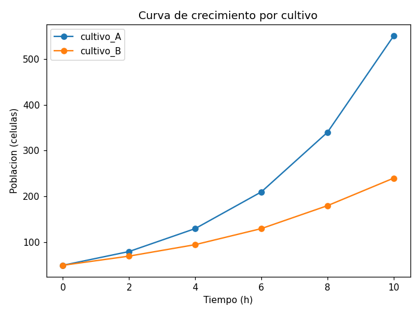
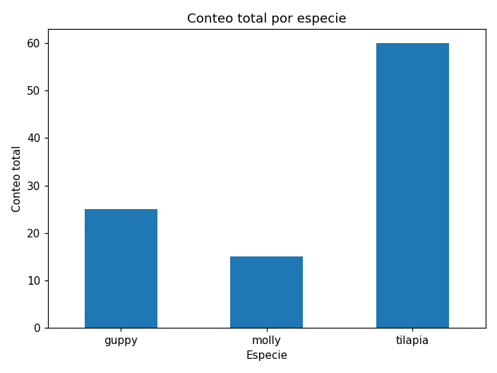
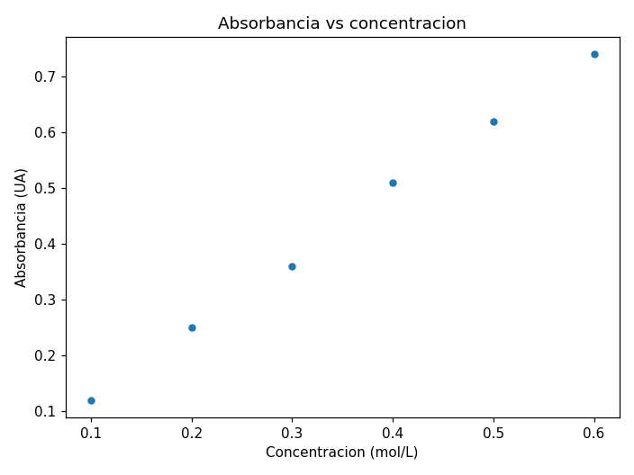
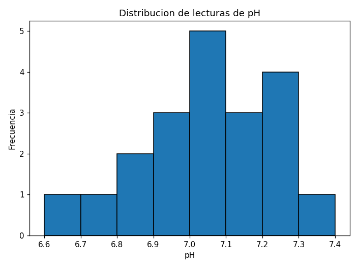
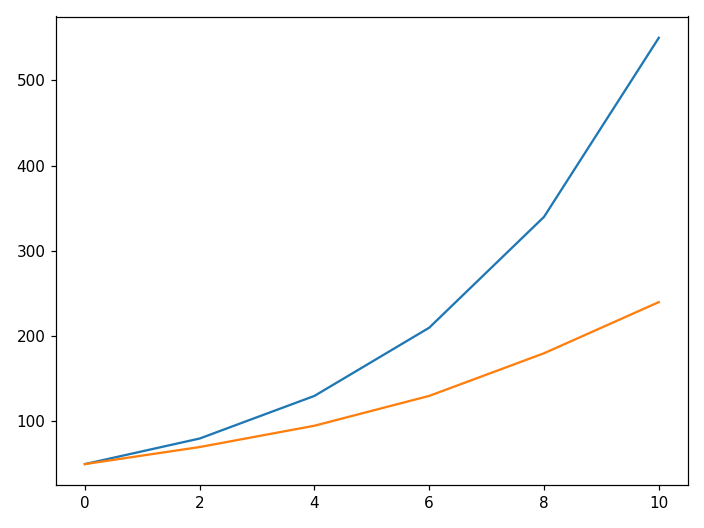

## Objetivos de aprendizaje

Al terminar esta lección podrás:

- **Importar** matplotlib (`import matplotlib.pyplot as plt`) y explicar que Pandas grafica con `df.plot` apoyándose en matplotlib. *(Comprender)*
- **Graficar** una serie temporal con `df.plot(x=, y=[...])` (línea) y leer la leyenda cuando hay varias series. *(Aplicar)*
- **Graficar** un agregado por categoría con `.plot.bar()` (barra) -- el `groupby` de la L22. *(Aplicar)*
- **Graficar** la relación entre dos variables con `.plot.scatter(x=, y=)` (dispersión). *(Aplicar)*
- **Graficar** la distribución de una columna con `.plot.hist(bins=)` (histograma). *(Aplicar)*
- **Rotular** bien una gráfica científica (título, ejes con unidades, leyenda) y justificar por qué una gráfica sin unidades no comunica. *(Comprender / Evaluar)*

> **Dónde encaja:** después de la L22 (*Pandas: análisis de datos*) · dentro del Módulo 3 · antes de la L24 (*Análisis de imágenes científicas*). La L21 y L22 te enseñaron a leer y resumir una tabla; hoy le das **ojos**: la conviertes en una gráfica.

## Por qué importa

La L22 te dio conteos y promedios -- `tilapia 60`, `guppy 25`. Pero una columna de números cuesta interpretar de un vistazo. Una **gráfica** lo dice en un segundo. Hoy le damos ojos a la tabla con **matplotlib**, la librería de gráficas de Python, a través del cómodo `df.plot` de Pandas.

El mensaje no es solo *cómo* se dibuja, sino **qué gráfica para qué pregunta**: una **línea** para algo que cambia en el tiempo (una curva de crecimiento), una **barra** para comparar categorías (el `groupby` de la L22), una **dispersión** para ver si dos variables se mueven juntas (absorbancia vs. concentración), un **histograma** para ver la forma de una medición. Y una regla de oro de la ciencia: **una gráfica sin rótulos de eje, unidades y leyenda no comunica nada** -- nadie sabe qué está mirando. Esa disciplina es la mitad de la lección.

> **Práctica (hands-on):** [Lab — Visualización científica](l23_lab_visualization.md) ·
> [](https://colab.research.google.com/github///blob//u03_scientific_computing/l23_lab_visualization.ipynb)

## Importar matplotlib y df.plot

Las gráficas de Python viven en **matplotlib**. Se importa su módulo `pyplot` con el alias `plt` (la convención, como `np` y `pd`):

```python
import matplotlib.pyplot as plt
import pandas as pd
```

Pandas ya trae el método **`df.plot`**, que se apoya en matplotlib: tú llamas a `df.plot(...)` sobre la tabla y matplotlib dibuja. Al final, `plt.show()` muestra la figura. Las variantes (`.plot.bar`, `.plot.scatter`, `.plot.hist`) eligen el tipo de gráfica.

## Gráfica de línea

Una **línea** sirve para algo que cambia a lo largo de una variable continua, como el tiempo. Con `crecimiento.csv` (la población de dos cultivos cada 2 horas), graficamos las dos columnas contra `hora`. Al pasar **varias** columnas en `y`, hay una línea por cada una y una **leyenda**:

```python
df.plot(x='hora', y=['cultivo_A', 'cultivo_B'],
        title='Curva de crecimiento por cultivo',
        xlabel='Tiempo (h)', ylabel='Poblacion (celulas)', marker='o')
plt.show()
```



Las dos poblaciones crecen, pero `cultivo_A` despega mucho más rápido (llega a 550 a las 10 h; `cultivo_B`, a 240). La **leyenda** dice qué línea es cuál, y los ejes rotulados con sus **unidades** (`Tiempo (h)`, `Poblacion (celulas)`) dejan claro qué se midió.

## Gráfica de barra

Una **barra** compara un valor entre categorías. Es la forma natural de **graficar un `groupby` de la L22**. Sobre la misma `biodiversidad.csv`, sumamos el conteo por especie y lo graficamos:

```python
totales = df.groupby('especie')['conteo'].sum()
totales.plot.bar(title='Conteo total por especie',
                 xlabel='Especie', ylabel='Conteo total', rot=0)
plt.show()
```



El resumen que en la L22 leíste como números (`guppy 25`, `molly 15`, `tilapia 60`) ahora se ve de un vistazo: la `tilapia` domina. *En la L22 lo calculaste; hoy lo visualizas.* Es la misma operación, con ojos.

## Gráfica de dispersión

Una **dispersión** (scatter) muestra si dos variables se mueven juntas. En química, la **absorbancia** de una muestra crece con su **concentración** (ley de Beer-Lambert). Con `absorbancia.csv`:

```python
df.plot.scatter(x='concentracion', y='absorbancia',
                title='Absorbancia vs concentracion',
                xlabel='Concentracion (mol/L)', ylabel='Absorbancia (UA)')
plt.show()
```



Los puntos suben casi en línea recta: a más concentración, más absorbancia. Esa relación lineal es justo lo que predice la ley de Beer-Lambert, y una dispersión la hace evidente. Si los puntos estuvieran dispersos sin patrón, veríamos que **no** hay relación.

## Histograma

Un **histograma** agrupa los valores de una columna en intervalos (`bins`) y cuenta cuántos caen en cada uno: muestra la **forma** (la distribución) de los datos. Con 20 lecturas de pH:

```python
df['ph'].plot.hist(bins=8, title='Distribucion de lecturas de pH',
                   xlabel='pH', ylabel='Frecuencia', edgecolor='black')
plt.show()
```



La mayoría de las lecturas se concentran cerca de pH 7.0, con pocas en los extremos (6.6 y 7.4). El histograma responde "¿cómo se reparten mis mediciones?" -- algo que una tabla de 20 números no muestra de un vistazo.

## Rotular bien una gráfica

Aquí está la regla de oro. Mira la **misma** curva de crecimiento, primero **sin** rótulos:



¿Qué muestra? Imposible saberlo: ¿qué es el eje horizontal? ¿el vertical, en qué unidades? ¿qué es cada línea? Una gráfica así no comunica. Ahora compárala con la versión rotulada de más arriba: título, ejes con **unidades** y **leyenda**. La diferencia no es estética -- es la que separa una figura científica útil de una inservible.

| Elemento | Para qué | Cómo |
|---|---|---|
| Título | qué muestra la gráfica | `title='...'` |
| Rótulo del eje x (con unidades) | qué es el eje horizontal | `xlabel='Tiempo (h)'` |
| Rótulo del eje y (con unidades) | qué es el eje vertical | `ylabel='Poblacion (celulas)'` |
| Leyenda | qué es cada serie | automática al pasar varias columnas en `y` |

## Preguntas frecuentes

**"¿Qué gráfica para qué pregunta?"** — **Línea**: algo que cambia a lo largo de una variable (el tiempo). **Barra**: comparar un valor entre categorías. **Dispersión**: la relación entre dos variables numéricas. **Histograma**: la distribución (la forma) de una sola columna. La pregunta decide el tipo.

**"¿Por qué insistir tanto en los rótulos y las unidades?"** — Porque una gráfica científica se lee sola. Sin título, rótulos de eje y unidades, nadie -- ni tú dentro de un mes -- sabe qué representa. Unas barras "de 60" no dicen nada; "60 individuos de tilapia" sí.

**"¿`df.plot()` o `df.plot.bar()`?"** — `df.plot(...)` hace una **línea** por defecto. Para los otros tipos se usa la variante: `.plot.bar()`, `.plot.scatter(x=, y=)`, `.plot.hist(bins=)`.

**"¿Necesito matplotlib si grafico con `df.plot`?"** — Sí. `df.plot` es un atajo de Pandas que **usa matplotlib** por dentro; por eso se importa `matplotlib.pyplot as plt` y se llama `plt.show()` para mostrar la figura.

## Para reflexionar

Practica y discute (en clase o por escrito):

1. Tienes la temperatura de un reactor medida cada minuto durante una hora. ¿Qué tipo de gráfica usarías y por qué?
2. ¿Qué le falta a una gráfica cuyo eje y solo dice "0, 100, 200" sin más?
3. ¿Cuándo una **dispersión** comunica mejor que una **línea**? (Pista: ¿hay un orden en el eje x?)
4. ¿Qué pregunta responde un histograma que una gráfica de barras no?
5. La barra de `tilapia` mide 60. ¿De dónde salió ese número en la L22?

## Resumen

| Idea clave | En una frase |
|------------|--------------|
| Importar | `import matplotlib.pyplot as plt`; Pandas grafica con `df.plot` (sobre matplotlib); `plt.show()` la muestra |
| Línea | `df.plot(x=, y=[...])` -- algo que cambia en el tiempo; varias columnas dan varias líneas + leyenda |
| Barra | `serie.plot.bar()` -- comparar categorías (graficar un `groupby`/`value_counts` de la L22) |
| Dispersión | `df.plot.scatter(x=, y=)` -- la relación entre dos variables numéricas |
| Histograma | `df['col'].plot.hist(bins=n)` -- la distribución (la forma) de una columna |
| Rótulos | título + ejes con **unidades** + leyenda; *una gráfica sin unidades no comunica* |

## Para profundizar

- **Texto del curso (código abierto):** *Introducción a la programación con Python 3* (Marzal, Gracia y García, UJI/Sapientia, licencia CC).
- **Documentación oficial:** *Chart visualization* en `pandas.pydata.org` y la galería de `matplotlib.org`.
- **Más allá de esta lección:** existen más tipos de gráfica (de caja `boxplot`, de pastel `pie`) y mucha personalización (colores, varios paneles con `plt.subplots`, guardar la figura con `savefig`). En la **S24** verás que una **imagen** también es datos -- un arreglo de NumPy -- y la procesarás. La idea de hoy -- *elige la gráfica según la pregunta y rotúlala con unidades* -- es la base de toda comunicación científica con datos.
