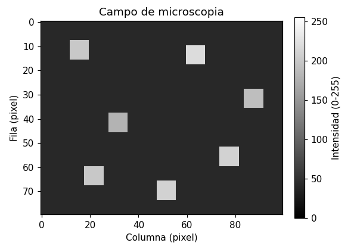
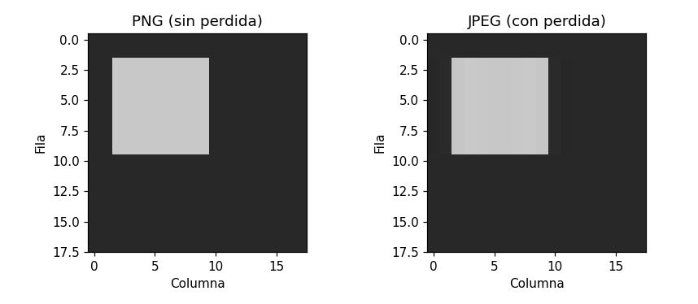
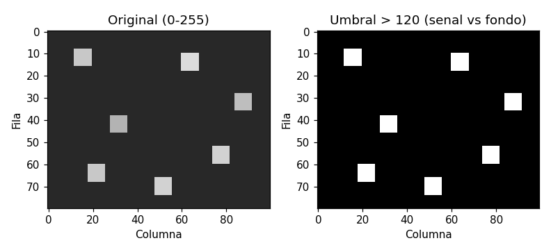
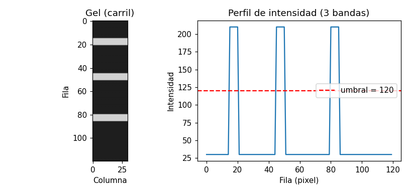

## Objetivos de aprendizaje

Al terminar esta lección podrás:

- **Explicar** que una imagen en escala de grises es un arreglo 2D de NumPy de intensidades 0-255, y **abrirla** con `Image.open` + `np.array` (`.shape`, `dtype`). *(Comprender)*
- **Reconocer** los formatos de imagen científica: PNG/TIFF **sin pérdida** vs. JPEG **con pérdida**, y por qué la ciencia prefiere sin pérdida. *(Comprender)*
- **Mostrar** un arreglo como imagen con `plt.imshow(arr, cmap='gray')` y leer una región con un rebanado. *(Aplicar)*
- **Umbralizar** una imagen (`mascara = arr > umbral`) y explicar que separa señal de fondo. *(Aplicar)*
- **Cuantificar** por área: `mascara.sum()` (píxeles de señal) y `mascara.mean()*100` (porcentaje de área cubierta). *(Aplicar)*
- **Contar** objetos discretos reduciendo la imagen a un perfil 1D (`arr[:, c]`) y contando los cruces de fondo a señal. *(Aplicar / Analizar)*

> **Dónde encaja:** después de la L23 (*Visualización científica*) · dentro del Módulo 3 · antes de la L25 (*Biopython*). Las L20-L23 trataron datos en tablas; hoy ves que **una imagen también es un dato numérico** -- un arreglo de NumPy -- y la analizas con lo que ya sabes.

## Por qué importa

Un microscopio, un gel de electroforesis o un espectrofotómetro no entregan una tabla: entregan una **imagen**. ¿También es "dato"? Sí. Una imagen en escala de grises es **una cuadrícula de números** -- un **arreglo 2D de NumPy** donde cada píxel es una **intensidad** de 0 (negro) a 255 (blanco). Y en cuanto es un arreglo, ya sabes operarlo con lo de la L20: `.shape`, rebanar, `.mean()`, y -- el corazón de hoy -- la **máscara booleana**.

El mensaje es que el análisis de imágenes científico se reduce a tres preguntas: **¿dónde está la señal?** (umbralización: separar célula/banda de fondo), **¿cuánta hay?** (área: contar píxeles de señal) y **¿cuántos objetos hay?** (reducir a un perfil 1D y contar). Las mismas destrezas de NumPy y matplotlib de las lecciones anteriores, sobre un dato nuevo.

> **Práctica (hands-on):** [Lab — Análisis de imágenes científicas](l24_lab_scientific_images.md) ·
> [](https://colab.research.google.com/github///blob//u03_scientific_computing/l24_lab_scientific_images.ipynb)

## Una imagen es un arreglo

Abrir una imagen es un par de líneas: Pillow (`PIL`) la carga y NumPy la convierte en arreglo.

```python
from PIL import Image
import numpy as np

img = Image.open('microscopia.png')
arr = np.array(img)
print(arr.shape, arr.dtype)        # (80, 100) uint8
```

El `shape` es `(alto, ancho)` -- aquí 80 filas por 100 columnas -- y el `dtype` es `uint8` (enteros 0-255). Cada número es un píxel. Para **ver** el arreglo como imagen se usa `plt.imshow` con el mapa de grises:



El fondo es oscuro (intensidad 40) y las células son brillantes (180-220). La **barra de color** traduce número a tono de gris. Como es un arreglo de NumPy, `arr.mean()` da la intensidad promedio y `arr[8:12, 12:16]` rebana una región de píxeles -- exactamente las operaciones de la L20, ahora sobre una imagen.

| Idea | En la imagen |
|---|---|
| Píxel | un número de intensidad: 0 = negro, 255 = blanco |
| Imagen en escala de grises | un arreglo **2D** `(alto, ancho)` de enteros `uint8` |
| `arr.shape` | `(filas, columnas)` = `(alto, ancho)` |
| Una región | un rebanado 2D: `arr[fila0:fila1, col0:col1]` |

## Formatos de imagen científica

En qué formato se guarda una imagen **cambia los datos**. **PNG** y **TIFF** son *sin pérdida*: preservan los valores de píxel exactos. **JPEG** es *con pérdida*: comprime alterando los valores. Guardar el mismo campo como PNG y como JPEG y reabrirlos lo demuestra:



El PNG devuelve el arreglo **idéntico** (`np.array_equal` da `True`, diferencia máxima 0); el JPEG no (`False`, algunos píxeles cambian hasta en 15) y se ven artefactos cerca de los bordes. Por eso una micrografía o un gel se guardan en **PNG/TIFF**: con JPEG medirías valores que la compresión inventó.

| Formato | Tipo | Para ciencia |
|---|---|---|
| PNG, TIFF | sin pérdida (valores exactos) | **sí** -- no inventa datos |
| JPEG | con pérdida (altera valores) | no para medir -- solo para fotos |

## Umbralización: separar señal de fondo

La operación central es la **umbralización**. `arr > umbral` produce un arreglo 2D de booleanos del mismo tamaño: `True` donde hay señal (brillante), `False` donde hay fondo. Es la **máscara booleana de la L20**, ahora en 2D.

```python
mascara = arr > 120
```



A la izquierda, la imagen original (tonos de gris); a la derecha, la máscara: solo señal (blanco) y fondo (negro). El umbral 120 cae entre el fondo (40) y las células (180-220), así que las separa limpiamente. **El umbral es una decisión:** muy alto pierde células tenues; muy bajo cuenta ruido del fondo.

## Contar y medir

Con la máscara ya se **cuantifica**. `mascara.sum()` cuenta los píxeles de señal, y `mascara.mean()*100` da el **porcentaje de área** cubierta:

```python
print(mascara.sum())             # 448 pixeles de senal
print(round(mascara.mean()*100, 2))   # 5.6  -> 5.6 % del campo
```

Eso responde "¿qué fracción del campo está ocupada por células?" -- una medición real de microscopía. La tabla resume qué técnica responde cada pregunta:

| Pregunta científica | Técnica | Código |
|---|---|---|
| ¿Dónde está la señal? | umbralización | `mascara = arr > umbral` |
| ¿Cuánta área cubre? | contar píxeles de señal | `mascara.sum()`, `mascara.mean()*100` |
| ¿Qué tan intensa es? | promedio de intensidad | `arr.mean()` |
| ¿Cuántos objetos hay? | perfil 1D + contar (abajo) | `arr[:, c]` |

## Contar objetos: el perfil 1D

El área no cuenta **objetos separados**. Para eso reducimos la imagen a un **perfil 1D**: tomar **una columna** (`arr[:, c]`, rebanar de la L20) da la intensidad fila por fila. En un gel, las bandas aparecen como **picos** del perfil.



El perfil sube sobre el umbral tres veces -- una por banda. Para **contar** esos cruces de fondo a señal usamos una función que recorre el perfil con un `for`, un `if` y un contador (lo de la L08-L11), recordando con un centinela si ya estamos sobre una banda:

```python
def contar_bandas(perfil, umbral):
    n = 0
    dentro = False
    for valor in perfil:
        if valor > umbral and not dentro:
            n += 1            # empieza una banda nueva
            dentro = True
        elif valor <= umbral:
            dentro = False    # volvimos al fondo
    return n
```

`contar_bandas(perfil, 120)` da **3**: los fundamentos del curso (un bucle, una condición, un contador) aplicados a un arreglo de NumPy, sin ninguna librería extra. La misma función cuenta los picos de un espectro.

## Preguntas frecuentes

**"¿Por qué `cmap='gray'`?"** — `plt.imshow` por defecto colorea los números con un mapa de colores llamativo. Una imagen en escala de grises se ve correctamente con `cmap='gray'`, que mapea 0 a negro y 255 a blanco.

**"¿Qué umbral elijo?"** — Es una **decisión**, no hay uno único. Un umbral muy alto pierde señal tenue; uno muy bajo cuenta fondo como si fuera señal. Se elige mirando la imagen y su histograma (la L23) y, a veces, probando varios.

**"¿Por qué no cuento las células directamente?"** — Contar objetos *pegados* o de forma irregular requiere "etiquetar" regiones conectadas, que necesita una librería como scikit-image (fuera de este curso). Por eso medimos **área** (robusto siempre) y, para objetos **bien separados** (bandas de un gel, picos de un espectro), usamos el **perfil 1D** y contamos los cruces.

**"¿PNG o JPEG para una micrografía?"** — **PNG** o **TIFF**, siempre que vayas a **medir**. JPEG altera los valores; medir sobre un JPEG es medir datos inventados por la compresión.

## Para reflexionar

Practica y discute (en clase o por escrito):

1. Una imagen de `(512, 512)` en escala de grises, ¿cuántos píxeles tiene? ¿Y cuántos números guarda el arreglo?
2. Si subes el umbral de 120 a 190, ¿el porcentaje de área cubierta sube o baja? ¿Por qué?
3. ¿Por qué medir sobre un JPEG puede dar un resultado distinto al del PNG original?
4. Para contar las bandas de un gel, ¿por qué tomamos **una columna** y no una fila?
5. La función `contar_bandas` usa un centinela `dentro`. ¿Qué pasaría si lo quitáramos y contáramos cada píxel sobre el umbral?

## Resumen

| Idea clave | En una frase |
|------------|--------------|
| Imagen = arreglo | una imagen en escala de grises es un arreglo 2D de NumPy de intensidades 0-255 |
| Abrir / mostrar | `Image.open` + `np.array`; `plt.imshow(arr, cmap='gray')` |
| Formatos | PNG/TIFF **sin pérdida** (exactos); JPEG **con pérdida** (los altera) |
| Umbralización | `mascara = arr > umbral` separa señal (True) de fondo (False) |
| Área | `mascara.sum()` (píxeles) y `mascara.mean()*100` (porcentaje de área) |
| Contar objetos | perfil 1D (`arr[:, c]`) + contar cruces de fondo a señal |

## Para profundizar

- **Texto del curso (código abierto):** *Introducción a la programación con Python 3* (Marzal, Gracia y García, UJI/Sapientia, licencia CC).
- **Documentación oficial:** *Pillow* (`pillow.readthedocs.io`) y la guía de imágenes de NumPy.
- **Más allá de esta lección:** una imagen **a color** es un arreglo **3D** `(alto, ancho, 3)` (los canales rojo, verde y azul). Para etiquetar y contar objetos pegados existen librerías como **scikit-image** (`measure.label`). En la **S25** cambiamos otra vez de dato: de los píxeles de una imagen a las **letras de una secuencia de ADN**, con la librería **Biopython**. La idea de hoy -- *una imagen es un arreglo; umbraliza para separar señal de fondo y cuenta* -- es la base del análisis de imágenes en toda la ciencia.
