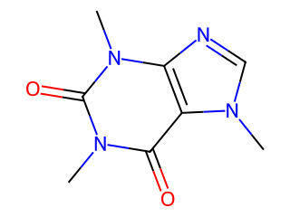

## Objetivos de aprendizaje

Al terminar esta lección podrás:

- **Explicar** qué es mendeleev (una librería de dominio para química) e importarla, y entender la tabla periódica como datos. *(Comprender)*
- **Cargar** la tabla periódica con `fetch_table` a un DataFrame e inspeccionarla (`len`, `.head`, columnas). *(Aplicar)*
- **Buscar y filtrar** elementos: seleccionar columnas, buscar uno por símbolo, recortar subconjuntos (un periodo, los más electronegativos). *(Aplicar)*
- **Graficar e interpretar** una tendencia periódica (radio atómico contra número atómico) con rótulos y unidades. *(Aplicar / Analizar)*
- **Reconocer** las propiedades y unidades de los elementos (Z, masa, periodo, grupo, electronegatividad, radio; `NaN`). *(Comprender)*
- *(Demo)* **Ver** cómo RDKit convierte un `SMILES` en fórmula, masa molecular y estructura. *(Comprender — no examinable)*

> **Dónde encaja:** después de la L25 (*Biopython*) · dentro del Módulo 3 · antes de la S27 (*Proyecto de datos científicos*). Cierra el tramo de **librerías de dominio**: la L25 le dio a la biología la suya (Biopython); hoy la química recibe la suya (mendeleev).

## Por qué importa

La **L25** le dio a la **biología** su librería de dominio: Biopython convirtió una secuencia de ADN en algo con métodos de biología. ¿Y la **química**? Su librería es **mendeleev**, y su idea es preciosa: la **tabla periódica como datos**. En vez de buscar en un libro el peso del hierro o la electronegatividad del flúor, los pides con código. `fetch_table('elements')` te entrega los 118 elementos como un **DataFrame** —la misma tabla de Pandas de la L21— y de pronto puedes hacer con la tabla periódica todo lo que ya sabes: **filtrar** (¿cuáles son los más electronegativos?), **seleccionar** (las propiedades del hierro) y **graficar una tendencia** (¿por qué se llama "periódica"?).

Es el mismo salto que recorre todo el módulo: de **"a mano" a "herramienta"**. El CSV que parseabas a mano (L19) se volvió `read_csv` (L21); el FASTA a mano (L16) se volvió `SeqIO.parse` (L25); la tabla periódica del libro se vuelve, hoy, un DataFrame sobre el que computas. Una librería de dominio no te enseña química nueva: te entrega los datos de la química, listos para las herramientas que ya dominas. Y para cerrar, una **demo** de **RDKit**: de un texto como `'CCO'` a la estructura y la masa del etanol —la química de las **moléculas**, no solo de los elementos.

> **Práctica (hands-on):** [Lab — Química con Python: la tabla periódica como datos](l26_lab_chemistry_mendeleev.md) ·
> [](https://colab.research.google.com/github///blob//u03_scientific_computing/l26_lab_chemistry_mendeleev.ipynb)

## La tabla periódica como un DataFrame

mendeleev se instala con `%pip install -q mendeleev` y trae la tabla periódica **empaquetada** (no se descarga nada de internet). `fetch_table('elements')` la entrega como un **DataFrame** de Pandas: una fila por elemento, una columna por propiedad.

```python
from mendeleev.fetch import fetch_table
tabla = fetch_table('elements')
print(len(tabla))   # 118
```

Son **118 elementos**, cada uno con **decenas de propiedades** (las columnas): demasiadas para mirarlas todas. Nos quedamos con unas pocas (seleccionar varias columnas con una lista, como en la L21):

```python
elementos = tabla[['atomic_number', 'symbol', 'name', 'atomic_weight', 'en_pauling', 'atomic_radius']]
print(elementos.head())
```

Cada columna es una propiedad del elemento, con su unidad:

| Columna | Qué es | Unidad |
|---|---|---|
| `atomic_number` | número atómico (Z) | entero |
| `symbol` / `name` | símbolo / nombre | texto |
| `atomic_weight` | masa atómica | u (unidad de masa atómica) |
| `period` / `group_id` | periodo (fila) / grupo (columna) | las coordenadas de la tabla |
| `en_pauling` | electronegatividad de Pauling | adimensional (mayor = atrae más los electrones) |
| `atomic_radius` | radio atómico | pm (picómetros) |

A veces un valor es **`NaN`** ("not a number", sin valor): por ejemplo, los gases nobles casi no forman enlaces, así que no tienen electronegatividad definida.

## Buscar y filtrar elementos

Como `elementos` es un DataFrame, **buscar** es **filtrar filas** (lo de la L21). Estos son los verbos:

| Quieres... | Código | Resultado |
|---|---|---|
| una columna | `elementos['atomic_weight']` | la columna de masas (una Series) |
| varias columnas | `elementos[['symbol', 'en_pauling']]` | un DataFrame más pequeño |
| un elemento | `elementos[elementos['symbol'] == 'Fe']` | la fila del hierro |
| un subconjunto | `elementos[elementos['en_pauling'] > 3.0]` | los más electronegativos |

```python
print(elementos[elementos['symbol'] == 'Fe'])         # el hierro: Z 26, masa 55.845, radio 140 pm
print(elementos[elementos['en_pauling'] > 3.0])        # N, O, F, Cl -- el fluor (3.98) es el mayor
```

El último filtro responde una pregunta de química real —¿cuáles son los elementos más electronegativos?— con la misma máscara booleana de la L21. La respuesta: solo nitrógeno, oxígeno, flúor y cloro, y el **flúor** es el más electronegativo de todos.

## Una tendencia periódica

Aquí se junta todo el módulo. Una vez que la tabla es un DataFrame, **graficamos** una tendencia con `df.plot` (L23). Tomamos los primeros 20 elementos y graficamos su **radio atómico** contra su **número atómico**:

```python
primeros = elementos[elementos['atomic_number'] <= 20]
primeros.plot(x='atomic_number', y='atomic_radius',
              title='Radio atomico de los primeros 20 elementos',
              xlabel='Numero atomico (Z)', ylabel='Radio atomico (pm)',
              marker='o', legend=False)
```


La gráfica muestra un **diente de sierra** que se **repite**: por eso la tabla es "periódica". Hay dos tendencias clásicas en ese patrón:

| Tendencia | Qué pasa con el radio | Por qué |
|---|---|---|
| a lo largo de un **periodo** (una fila, de izq. a der.) | **baja** (de Li 145 a F 50) | el núcleo atrae más fuerte a los electrones |
| al bajar por un **grupo** (una columna) | **sube** (Li 145, Na 180, K 220) | cada nivel añade una capa de electrones |

Los **máximos al inicio de cada periodo** (Z = 3, 11, 19) son los **metales alcalinos** (Li, Na, K): abren cada periodo y crecen al bajar por el grupo. (Un detalle honesto: los **gases nobles** —He, Ne, Ar— se miden con otra convención y quedan **fuera** del patrón; por eso el Ne aparece tan alto, incluso por encima del Li. Conviene leerlos aparte.) Y, como toda gráfica científica, lleva **título** y **rótulos de eje con unidades** (el radio en `pm`), la disciplina de la L23.

## Demo: de un SMILES a una molécula (RDKit)

mendeleev te da los **elementos**; **RDKit** te da las **moléculas**. Un **`SMILES`** es un texto que describe una molécula (`'CCO'` es el etanol, `'O'` el agua). RDKit lo convierte en una molécula y calcula su **fórmula** y su **masa molecular**:

```python
from rdkit import Chem
from rdkit.Chem import Descriptors, rdMolDescriptors, Draw
etanol = Chem.MolFromSmiles('CCO')
print(rdMolDescriptors.CalcMolFormula(etanol))   # C2H6O
print(round(Descriptors.MolWt(etanol), 2))       # 46.07
```

Y también **dibuja** la estructura. Aquí, la cafeína (`'CN1C=NC2=C1C(=O)N(C(=O)N2C)C'`):



> **Esto es una demo, no entra en el examen.** RDKit es enorme (estructuras, reacciones, similitud entre moléculas); lo muestra el instructor para que veas la otra cara de la química con Python. Lo examinable de esta lección es **mendeleev**.

## Preguntas frecuentes

**"¿`fetch_table` baja datos de internet?"** — No. mendeleev trae la tabla periódica **empaquetada** con la librería; `fetch_table('elements')` la lee de ahí, sin red. Por eso corre igual en Colab que sin conexión.

**"¿Qué son `period` y `group_id`?"** — Las **coordenadas** de la tabla periódica: `period` es la fila (1 a 7) y `group_id` la columna (1 a 18). Juntas ubican a cada elemento en la tabla que cuelga en el salón de química.

**"¿Por qué hay `NaN`?"** — Significa que esa propiedad **no está definida** para ese elemento. El ejemplo típico es la electronegatividad de los **gases nobles** (helio, neón): casi no forman enlaces, así que no se les asigna un valor.

**"¿RDKit entra en el examen?"** — No. Es una **demo** para que veas la química de **estructuras moleculares**. Lo examinable es **mendeleev** (la tabla periódica como datos).

## Para reflexionar

Practica y discute (en clase o por escrito):

1. ¿En qué se parece `fetch_table('elements')` a `pd.read_csv` de la L21? ¿Qué te ahorra cada uno?
2. La tabla tiene decenas de columnas. ¿Cómo seleccionarías solo `symbol` y `atomic_weight`? ¿Y solo los elementos con masa menor que 10?
3. En la gráfica de radio atómico, ¿qué elementos marcan los máximos al inicio de cada periodo? ¿Y por qué crees que los gases nobles (He, Ne) se salen del patrón?
4. La electronegatividad **sube** a lo largo de un periodo. ¿Esperarías que su gráfica fuera también un diente de sierra? ¿Por qué?
5. ¿Qué ventaja tiene tener la tabla periódica como un DataFrame frente a una imagen de la tabla colgada en la pared?

## Resumen

| Idea clave | En una frase |
|------------|--------------|
| mendeleev | librería de dominio para química; `%pip install -q mendeleev` |
| `fetch_table('elements')` | la tabla periódica como un **DataFrame** (118 elementos y sus propiedades) |
| Buscar / filtrar | es Pandas (L21): `elementos[elementos['symbol'] == 'Fe']`, `elementos[elementos['en_pauling'] > 3.0]` |
| Propiedades | `atomic_number` (Z), `atomic_weight` (u), `period`/`group_id`, `en_pauling`, `atomic_radius` (pm); `NaN` = sin valor |
| Tendencia periódica | graficar `atomic_radius` contra `atomic_number` (L23): el diente de sierra que se repite |
| RDKit (demo) | de un `SMILES` a una molécula: fórmula, masa molecular y estructura (no examinable) |

## Para profundizar

- **Texto del curso (código abierto):** *Introducción a la programación con Python 3* (Marzal, Gracia y García, UJI/Sapientia, licencia CC).
- **Documentación oficial:** mendeleev (`mendeleev.readthedocs.io`) y RDKit (`rdkit.org`).
- **Más allá de esta lección:** mendeleev también te da **un solo elemento** como objeto (`from mendeleev import element; element('Fe').atomic_weight`), con decenas de propiedades más (energías de ionización, configuración electrónica, isótopos). RDKit hace mucho más —comparar moléculas, simular reacciones, buscar subestructuras—, pero todo parte de la idea de hoy: *los datos de la química son datos, y la librería de dominio les da sus operaciones*. En la **S27** pondrás todo esto a trabajar en el **proyecto** del módulo, con una pista de química a tu elección.
